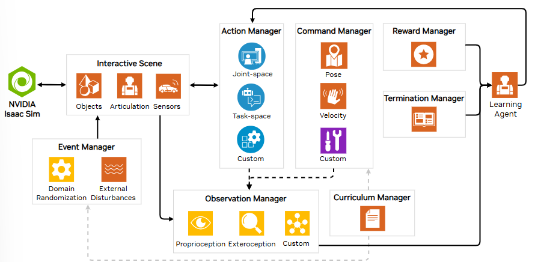
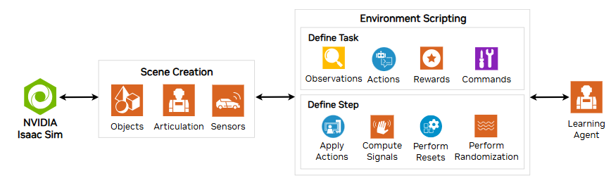

# Apuntes IsaacLab

## Task Design
Las tasks estan definidas por un ecosistema con interfaces específicas para las observaciones y las acciones del robot. 

El ecosistema es lo que ejecuta las acciones del robot y provee de observaciones.

En ML hay una gran cantidad de componentes comunes para todos los robots y ecosistemas. Por ello IsaacLab va a proveer de un modo de programación llamado Manager-based basado en clases. Existe otro metodo llamado Direct que se basa en funciones para tener un control más fino.
En este proyecto nos vamos a centrar en el control basado en manager. Aunque dependiendo de la dificultad al replicar las ventosas quiza se tenga que pasar a uno directo.

### Manager-based
En manger based utilizamos clases para crear manejadores de los observadores, de las rewards, etc. La coordinación de estas clases viene dada por el ecosistema, que siempre hereda de envs.ManagerBasedEnv. Las configuraciones deben de heredar de envs.ManagerBasedEnvCfg.

### Direct
Una única clase implementa las recompensas, las observaciones etc. Los usuarios tienen la libertad de implementar sus tareas a través de APIs de envs.DirectRLEnv o envs.DirectMARLEnv. La ventaja de este sistema es que se define explicitamente el ecosistema en vez de indirectamente mediante clases

## Actuadores
Los sistemas aticulados se conforman de articulaciones accionadas que resultan en grados de libertad. En las simulaciones se podrán controlar estas actuaciones por posición velocidad o par. En velocidad y posición se calcula el par mediante un PD mientras que en par se utiliza el dato directamente.

### Modelos

Se pueden utilizar dos modelos de actuadores:
- Implicito: Simulacones ideales propulsadas por el motor físico.
- Explicito: Drives externos por el usuario.

El control explicito tiene dos funciones principales: 1) Calcular el par de la unión; 2) Grabar el par deseado en las capacidades del motor. Estos pares grabados son los que luego se utilizaran en la simulación.

### Grupos
Los modelos de los actuadores solo reciben el par requerido y devuelven el par que se aplicará en la simulación. Para montar la estructura del robot habrá que utilizar la clase isaaclab.assets.Articulation, que agrupa las físicas del robot.

Los actuadores se agrupan en un conjunto de uniones que utilizan el mismo modelo de actuador.

## Sensores
Todos los sensores de IsaacLab heredan de la clase abstracta SensorBase, que provee de una interfaz común para manejar los sensores. La idea principal del sensor es tomar medidas acerca de el ecosistema. Los sensores se van actualizando con el tiempo de manera parecida a un buffer y los datos pueden ser de distintos tipos.

La variable update_period en segundos simulados sirve para describir el flujo de la información. La actualización de los buffers viene dada al anular la función _update_buffers_impl de la clase SensorBase. En cada paso dt de la simulación se comprueba que no se supere la variable y cuando se hace se pone en cola para actualizar en la siguiente iteración.
### Camera
### Contact Sensor
### Frame Transformer
### Inertial Mesurement Unit (IMU)
### RayCaster

