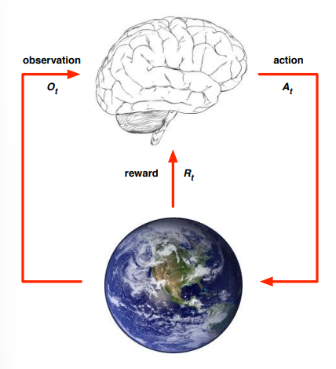

# Introducción al aprendizaje por refuerzo
## Características del AR
- No hay supervisor
- La correción viene retrasada (se puntúa al final)
- El tiempo importa
- Las acciones del agente influyen en la información recabada
## Recompensas (Rewards)
Una recompensa es una señal de realimentación escalar que nos permite valorar los resultados de una acción de un agente. Los agentes deben tender a maximizar esta recompensa.

La hipótesis de la recompensa dice que todos los objetivos se pueden definir por una recompensa esperada.

### Toma de decisiones secuencial
El objetivo siempre va a ser maximizar la recompensa. Para ello deberemos tener en cuenta el restraso de esta, por lo que muchas veces deberemos sacrificar una recompensa inmediata por una mayor recompensa final.

## Estructura.
La estructura de un sistema de aprendizaje por refuerzo se puede describir con dos elementos, el ecosistema y el agente. El agente realiza acciones sobre el ecosistema, observa su estado y recibe recompensas de él.

## Estado
Dentro del AR hay dos conceptos importantes, la historia y el estado.

La historia es el conjunto de observaciones, acciones y recompensas que se dan a través del tiempo. Las acciones que tome el agente vendrán determinadas por la historia.

El estado es toda la información relevante para determinar lo que ocurrirá a continuación, ya sea el agente o el estado. El estado depende de la historia S=f(H). El estado de un ecosistema no suele ser visible  por el agente y, aunque lo fuese, contendría información irrelevante. El estado del agente es toda la información que se utilice para tomar la próxima decisión.
### Estado informativo (Markov)
El estado informativo o el estado markov contiene información relevante de la historia. Para que el estado sea de este tipo el siguiete estado debe venir determinado únicamente por este último estado, de modo que los estados anteriores en t sean irrelevantes y se puedan desechar.
### Observabilidad
Un estado puede ser completamente observable, lo que resulta en que el estado del agente es el mismo que el del ecosistema. 

El estado también puede ser parcialmente observable, donde se observa indirectamente el ecosistema. En este caso tenemos solo parte de la información y el resto debe derivarse de esta. En este caso el estado del agente y del ecosistema es distinto. A este caso se le llama "partially observable Markov decision process" o POMDP.

## Agente
Dentro del agente podemos encontrar una o más de estas opciones.
- Policy (política): La función del comportamiento del agente. 
- Value function (función de valor): Valoración del estado en el cual nos encontramos. Predice la futura recompensa que podemos obtener desde ese estado.
- Model: Representación del ecosistema según el agente. Esto predice lo que pueda pasar en el modelo.
### Categorización.
Los agentes pueden ser del siguiente tipo en función del valor y la política:
- Value based (basados en valor)
- Policy based (basados en la política)
- Actor critic (Crítico): Valora tanto el valor como la política.
Y según el modelo pueden ser: Basados en Modelo | Libres de Modelo.

## El problema de AR
Aprendizage por refuerzo es una forma de afrontar la toma de decisiones. En este ámbito encontramos dos vías principales.
- Planificación: Se diseña un modelo del ecosistema y el agente realiza cálculos a través de ese modelo.
- Aprendizaje por refuerzo.
### Explotación vs Exploración
El objetivo en ambos casos es encontrar una política que nos permita maximizar la respuesta. Para ello en Aprendizaje por refuerzo debemos interactuar con el ecosistema para encontrar una política adecuada. Sin embargo una vez encontramos una política surge el siguiente problema, debemos ajustarnos a la política conocida o debemos probar otra política, sacrificando recompensa, intentando buscar una mejor.
### Predicción y Control
La predicción utiliza una política para predecir el futuro. 
El control busca la mejor política que utilizar.
