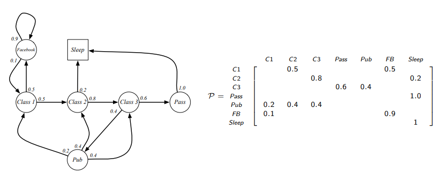
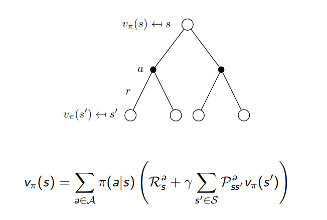
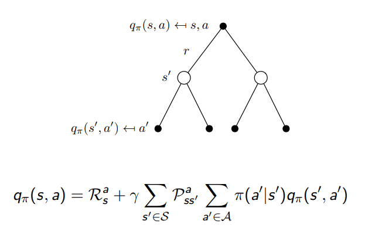
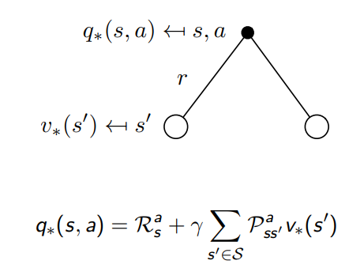
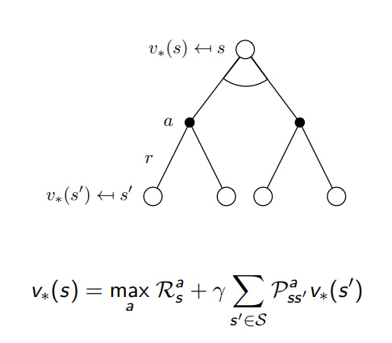

# Procesos de decisión Markov MDP
## Procesos Markov
### Introducción a los MDPs
Un MDP es un exosistema de aprendizaje por refuerzo totalmente observable. La mayoría de los problemas sobre AR se pueden formalizar como MDPs.
### Proceso Markov o Cadena Markov
Un proceso Markov es un proceso aleatorio que recorre una secuencia de estados, donde los estados son finitos y existe una probabilidad de transicionar de uno a otro. Esta probabilidad se recoge en la matriz de transición Markov.
### Matriz de transición Markov
La matriz de transición comprende todas las probabilidades de pasar de un estado a otro. En un conjunto de tres estados se podría describir una matriz de transición 3x3 de modo que:

    P={(P_1a1, P_1a2, P_1a3), (P_2a1, P_2a2, P_2a3), (P_3a1, P_3a2, P_3a3)} 
    donde 
    P_iaj = P[S_t1 = S_j | S_t=S_i]

## Proceso de recompensa Markov
Un proceso de recompensa Markov es un proceso markov con valores. El proceso de recompensa Markov contiene estados finitos S, matriz de probabilidad P, función de recompensa R y factor de descuento dto.
### Retorno.
El retorno es la recompensa total descontada para un paso de tiempo t tal que:

    G_t = R_t1 +dto * R_t2 + ...=
    =Sum(k=0 ; inf ; k++){(dto ** k) * R(t + k + 1)}

### Función de Valor
La función de valor devuelve para un estado valores a largo plazo de ese estado, de modo que:

    v(s) = E[G_t | S_t = s] = E[R_t1 + dto * R_t2 + (dto ** k) * R_t3+ ... | S_t = s]

### Ecuación Belman para MRPs
La función de valor entonces se puede descomponer en dos partes, la recompensa inmediata R_t1 y el valor del siguiente estado, ya que:

    v(s) = E[R_t+1 + dto * (R_t2 + dto * R_t3 + ... ) | S_t = s] 
    = E[R_t1 + dto * Gt1 | S_t = s]

Por tanto para una V\[n_estados\], R\[n_estados\], P\[n_estados\]\[n_estados\], encontramos la ecuación:

    V = R + dto * P * V
    V = (1- dto * P) ** -1 * R

## Proceso de decisión Markov
Una política (pl) es la función que describe el comportamiento del agente. Las políticas de un MDP dependen enteramente de el estado actual y no de la historia. Las políticas son independientes del tiempo.

    P_pl(s)(s') = Sum(for a in A) {pl(a | s) * P_a(s)(s')}
Es decir, la probabilidad de transicionar de un estado a otro es la probabilidad de escoger una acción (política) por la probabilidad de que con esa acción se pase a ese nuevo estado.

    R_pl(s) = Sum(for a in A) {pl(a | s) * R_a(s)}
Es decir, la recompensa de un estado s es igual a la probabilidad de escoger una acción por la recompensa de tomar esa acción en ese estado.

    v_pl(s) = E_pl[G_t | S_t = s]
Es decir, la función de valor de un estado es igual al retorno de ese mismo estado siguiendo la expectación de la política.

    q_pl(s, a) = E_pl[G_t | S_t = s, A_t = a]
Es decir, la función de valor-acción para un conjunto acción estado es el retorno esperado según la política al tomar una acción en un estado.

### Ecuación de Bellman
Como hemos visto entonces, para un estado s, el valor de la función de estado será el sumatorio de multiplicar la probabilidad de tomar una decisión (La política) por la recompensa inmediata de la acción más el descuento por el sumatorio de la probabilidad de pasar a un estado por el valor de dicho estado para todos los estados posibles.

Por otro lado, para un estado s y una acción a el valor de la función valor-estado será la recompensa inmediata por tomar esa acción más el descuento por el sumatorio para todos los estados posibles de la probabilidad de transicionar a un estado por el sumatorio para rodas las acciones posibles de la probabilidad de tomar una acción (la política) por la función valor acción de dicha acción.

Obteniendo que la ecuación de Bellman para una política es.

    V_pl = (1 - dto * P_pl) ** -1 * R_pl

### Valores óptimos
Los valores óptimos son los valores máximos que se pueden obtener para un estado de la función valor o para un conjunto estado-acción de un valor.

    V_op(s) = max(for pl in Policies) {V(pl)(s)}
    Q_op(s, a) = max(for pl in Policies) {Q(pl)(s)}
    donde Q y V es una matriz de todas las funciones valor, valor acción de una política

### Política óptima
Una política es mejor que otro solo cuando para todos los estado las funciones valor son mayores que las del estado a comparar.
La pólitica óptima es la mejor política entre todas las políticas que cumple este criterio.
    pl >= pl' if for s in S {v_pl(s) > v_pl(s)}
    pl = pl_op if for p in Policies {pl >= p}

Una manera de encontrar la política óptima es maximizando el valor de la política para un conjunto acción estado donde para ese mismo conjunto acción estado el valor-acción es máximo. 

Para calcular la función valor-acción máxima debemos sumar la recompensa inmediata mas el descuento por el sumatorio para todos los estados de la probabilidad de acabar en dicho estado al tomar dicha acción por la función valor óptima de dicha acción.

Para calcular la función valor óptima de un estado debemos tomar el máximo de la suma de la recompensa inmediata de tomar una acción mas el descuento por el sumatorio de todos los estados de la probabilidad de acabar en dicho estado al tomar dicha acción por la función valor óptima para dicho estado.

Estas ecuaciones son no lineales, por lo que habrá que realizar metodos iterativos para resolverlo. En las siguientes lecturas se daran metodos dinámicos de programación para resolver estos problemas.