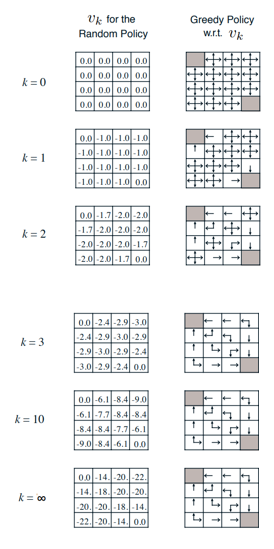

# Planificación con programación dinámica
## Introducción
### Definición

Dinámico es una cualidad en la cual algo depende de una secuencia o un tiempo.

Programación es la optimización de un problema.

La programación dinámica es un método para resolver problemas complejos. En ella el problema se divide en varios subproblemas los cuales se pueden solucionar por separado. Dichas soluciones luego se pueden combinar para encontrar la solución final.

### Requerimentos
La programación dinámica sirve como una solución general para problemas en los que encontramos una estructura óptima que sirve como solución al problema y una repetición de un subproblema del problema principal. Los procesos Markov satisfacen ambas cualidades.

### Planificación
La programación dinámica asume el conocimiento total del ecosistema, por lo que se utiliza para la planificación (recordemos que es una parte del problema de RL). Dentro de la planificación podemos realizar predicciones o diseñar el control del agente.

## Evaluación de políticas
### Introducción
La programación dinámica se puede utilizar para, dada una política, realizar métodos iterativos utilizando la ecuación de Bellban esperada con el fín de obtener la función valor de todos los estados. Se puede realizar de manera síncrona, actualizando todos los estados de manera consecutiva, o asíncronamente.

### Principio
Dado un estado s la siguiente función valor sera igual a la suma para todas las acciones de la probabilidad de tomar dicha acción por la suma de la recompensa inmediata de tomar dicha acción en dicho estado por el descuento más la suma para todos los estados posibles de la probabilidad de acabar en ese estado dada la acción más la función valor actual de ese siguiente estado. 

Para k = inf entonces V(k+1)(s) = V_pol, es decir, la secuencia converge a la función valor real.

### Mejora de la política (iteración de políticas)
Tomada una política y estudiados sus funciones valor podemos obtener una mejor política eligiendo la acción en función de esa función valor, de modo que siempre tratemos de llegar al estado con mayor valor (greedy policy).

    pol2(s) = (a) argmax(for a in A)()

    q_pol(s, pol2(s)) = max(for i in A)(q_pol(s, a)) >= q_pol(s, pol1(s)) = v_pol(s)

## Iteración de valores
### Principio de óptimo
Una política óptima se compone de dos factores, una acción inicial óptima seguida por una política óptima desde el estado siguiente. Una política óptima es aquella toma el valor óptimo desde el estado s1, si y solo sí para cualquier estado alcanzable s2 desde s1, el valor de ese estado con dicha política es igual al estado óptimo de dicho estado.

### Iteración de valores determinista
La iteración de valores determinista se base en que al conocer la solución al subproblema de la función de valor óptima del siguiente estado podemos obtener la función valor del estado anterior. (one-step look ahead)
    V_op = max(for a in A)(R(a)(s) + dto * sum( for s' in S) P_a(s)(s') * V_op(s'))
