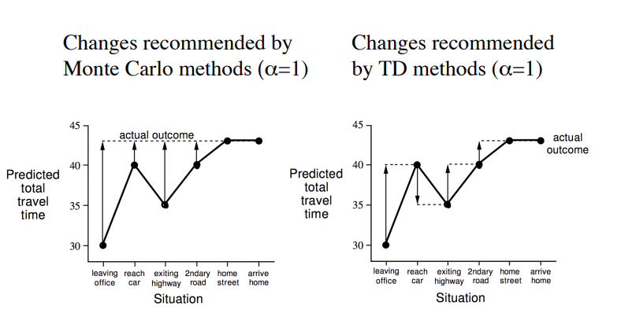
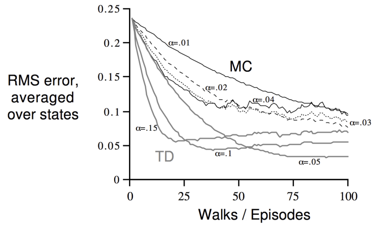
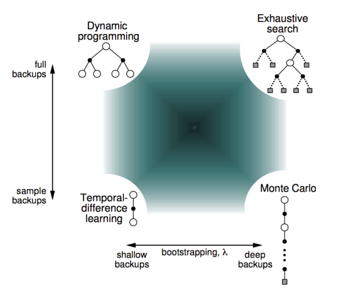
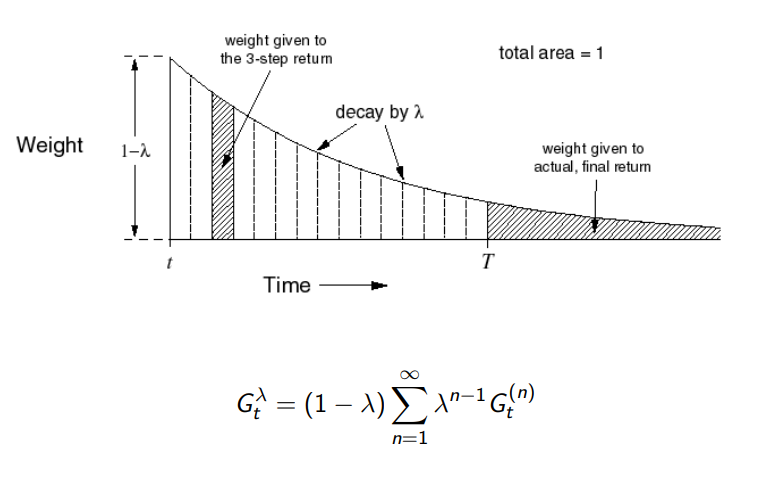

# Predicción sin modelo
## Monte-Carlo
El metodo Monte-Carlo es un método de aprendizaje automático sin modelo. Este modelo aprende directamente de su experiencia en episodios finitos y completos \(sin *bootstraping*\). Al ser un método sin modelo, no tenemos conocimiento sobre las recompensas o las transiciones que conformen el entorno. El método Monte-Carlo se basa en la idea de que el valor es igual al objetivo de retorno.

### Evolución de la política
El objetivo principal del método MC es encontrar la función valor de la política. En este metodo dictaminamos en vez de usar el retorno esperedo (expected return) por el retorno promedio (mean return).

Entonces, para valuar el estado S, realizamos una serie valoraciones donde calculamos el valor de retorno. Todos estos valores se suman y se hace la media.

    N(s) = N(s) + 1; S(s) = S(s) + 1; V(s) = S(s) / N(s);
    Cuando N(s) => inf, entonces V(s) => v_pol(s)

### Actualizaciones incrementales
La media incremental se calcula como

    u(k) = 1/k * Sum(for j = 1 in k)(x(j) = x(j-1) + 1);
    u(k) = u(k-1) + 1/k * (x(k) - u (k - 1));

Es decir, el siguiente valor promedio incremental será el anterior más el error entre el numero de la iteración.

Aplicado al método Monte-Carlo:

    V(S_t) = V(S_t) + 1/N(S_t)(G_t - V(S_t));

Es decir, la función valor de un estado S_t es igual a la función valor anterior más el error entre la función valor y el retorno real entre el número de iteración.

En casos en los que estudiemos un entorno dinámico, es recomendable olvidar el episodios anteriors, para lo cual se añade un parametro din.

    V(S_t) = V(S_t) + din * (G_t - V(S_t));

## Método Temporal-Difference o TD
El método TD es un metodo que sirve para aprender de episodios sin necesidad de completarlos. Esto lo hace mediante *bootstraping* que permite actualizarse a medida que avanza. Esto lo hace realizando un paso y estimando desde ese paso el retorno mediante la función valor.

    V(S_t) = V(S_t) + din * (R_t1 + dis * V(S_t1) - V(S_t));

Es decir, la función valor para un estado S_t es igual a la función valor anterior más el factor dinámico por el error entre, la suma de la recompensa inmediata más la función valor del siguiente estado, y la función valor anterior.

### MC vs TD 
Lo importante a entender es que el método Monte Carlo se actualiza al final, mientras que el método TD se va actualizando a cada paso de estado. Más adelante veremos que el método TD permite un parametro act (lamda), que permite dictaminar el número de estados que se contemplará.

Es importante tener en cuenta también, que el método Monte-Carlo tiene más ruido, mientras que el método TD tiene menos ruido introduciendo, sin embargo, un sesgo. Este sesgo es debido a asumir la función valor del siguiente estado.

Por otro lado, TD explota la propiedad de Markov, mientrac que MC no. Recordemos que la propiedad Markov indica que la secuencia de estados viene enteramente determinada por la información que tenemos de un estado.

### Gráfico Aprendizaje por Refuerzo

- Progrmación Dinámica: Estudia todos los casos y explota el principio Markov, utilizando la función valor estimada del siguiente valor.
- Búsqueda Exhaustiva: Estudia todos los casos, realizando muestras enteras hasta la terminación.
- TD: Estudia un caso, aprovechando la propiedad Markov. Al ser sin modelo, debe mapear caso a caso la cadena.
- MC: Estudia un caso, realizando muestras enteras hasta la teminación. Al ser también sin modelo, debe mapear caso a caso la cadena.

## TD(lamda) 
El problema con el método TD es que, a veces, necesitamos mirar más lejos de un paso para obtener una mayor precisión. Para ello, utilizamos un parametro lamda.

    G_t(lamda) = (1 - lamda) * Sum(for n = 1 in inf)(lamda^(n-1) * G_t(n));

De este modo, y en función del parametro lamda, se ira reduciendo el peso a medida que se avance por los estados. Se realiza esta ponderación geométrica debido a su bajo coste computacional.

**Repasar Fordward-view**